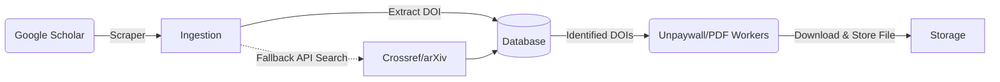

# scholarr

<div align="center">

Self-hosted scholar tracking with a single app image (API + frontend). It automates publication discovery, parses Google Scholar, gathers external metadata via Crossref & arXiv APIs, and autonomously downloads Open Access PDFs.

[](https://github.com/JustinZeus/scholarr/actions/workflows/ci.yml)
[](https://hub.docker.com/r/justinzeus/scholarr)
[](https://hub.docker.com/r/justinzeus/scholarr)

</div>

## Key Features
- **Automated Ingestion**: Background tasks regularly scrape author profiles to pull the latest publications.
- **Resilient Parsing**: Custom DOM parsing logic falls back heavily across changes, backed by a dynamic `429 Too Many Requests` backoff cycle.
- **Identifier Subsystem**: Isolates DOIs, PMIDs, and arXiv IDs independently of PDFs mapping fallback external APIs sequentially.
- **Unpaywall PDF Search**: Leverages a fully automated resolution queue to grab public PDFs via the Unpaywall API on identified entries.
- **Beautiful UI**: Polished Vue 3 frontend that ships natively inside the same Docker container as the FastAPI backend.

## Architecture Data Flow


## Quick Start

1. Copy env template:

```bash
cp .env.example .env
```

2. Set required values in `.env`:
- `POSTGRES_PASSWORD`
- `SESSION_SECRET_KEY`

3. Start stack:

```bash
docker compose pull
docker compose up -d
```

Open:
- App/API: `http://localhost:8000`
- Health: `http://localhost:8000/healthz`

## Documentation

Complete documentation is published at:
- https://justinzeus.github.io/scholarr/

You can also read the developer/architecture breakdowns directly within the repository under:
- `docs/developer/architecture.md`
- `docs/developer/ingestion.md`
- `docs/developer/api-contract.md`

## Quality Gates

Backend:

```bash
docker compose -f docker-compose.yml -f docker-compose.dev.yml run --rm app uv run pytest tests/unit
docker compose -f docker-compose.yml -f docker-compose.dev.yml run --rm app uv run pytest -m integration
```

Frontend:

```bash
# ALL tests/builds MUST be run within the docker container. Do not run raw npm commands on the host.
# For automated agents checking outputs, redirect stdout/stderr to files (e.g. > /tmp/npm_typecheck.log 2>&1) 
# The temp files /tmp/npm_test.log, /tmp/npm_lint.log, /tmp/npm_typecheck.log, and /tmp/pytest_eval.log are pre-authorized for overwrite.

docker compose -f docker-compose.yml -f docker-compose.dev.yml run --rm frontend npm install
docker compose -f docker-compose.yml -f docker-compose.dev.yml run --rm frontend npm run typecheck
docker compose -f docker-compose.yml -f docker-compose.dev.yml run --rm frontend npm run test:run
docker compose -f docker-compose.yml -f docker-compose.dev.yml run --rm frontend npm run build
```

Contract and env checks:

```bash
python3 scripts/check_frontend_api_contract.py
python3 scripts/check_env_contract.py
./scripts/check_no_generated_artifacts.sh
```
thanks arxiv