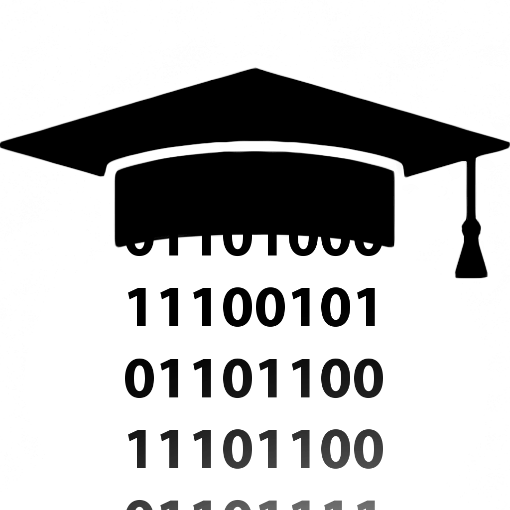
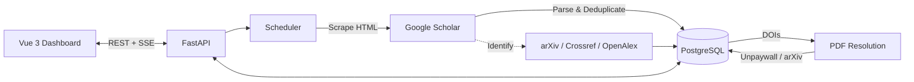

<div align="center">

<picture>
  <source media="(prefers-color-scheme: dark)" srcset=".github/logo-dark.png" />
  <source media="(prefers-color-scheme: light)" srcset="frontend/public/scholar_logo.png" />
  
</picture>

# Scholarr

**Self-hosted academic publication tracker.**

Track Google Scholar profiles, discover new papers automatically,
resolve open-access PDFs, and stay on top of the literature you care about.

[](https://github.com/JustinZeus/scholarr/actions/workflows/ci.yml)
[](https://hub.docker.com/r/justinzeus/scholarr)
[](https://justinzeus.github.io/scholarr/)

</div>

---

<!-- TODO: Replace these placeholders with actual screenshots.
     Drop PNG/JPEG files into docs/assets/ and update the paths below.

     Recommended screenshots:
       1. Dashboard / publications list (light or dark mode)
       2. Scholar profile view
       3. Run detail with progress

     Ideal dimensions: 1200-1400px wide, PNG or WebP.
-->

<p align="center">
  
</p>

<!--
<p align="center">
  
  
</p>
-->

## Why Scholarr?

Most researchers track new papers by manually checking Google Scholar, setting up email alerts, or juggling RSS feeds. Scholarr replaces all of that with a single self-hosted service:

- **Add scholars once** -- by profile URL, Scholar ID, or name search
- **Publications appear automatically** -- a background scheduler scrapes profiles on a configurable interval
- **Open-access PDFs are resolved for you** -- Unpaywall and arXiv are queried automatically when a DOI is found
- **Everything is deduplicated** -- publications are global records; no duplicates across scholars
- **Your data stays yours** -- fully self-hosted, export/import your entire library at any time

## Features

| | |
|---|---|
| **Automated Ingestion** | Background scheduler with configurable intervals, continuation queue, and multi-page pagination |
| **Identifier Resolution** | Cross-references arXiv, Crossref, and OpenAlex to gather DOIs, arXiv IDs, PMIDs |
| **PDF Discovery** | Resolves open-access PDFs via Unpaywall API and arXiv, with automatic retry queue |
| **Scrape Safety** | Rate limiting, cooldowns, and backoff strategies that prevent IP bans -- these are safety floors, not optional |
| **Multi-User** | Session-based auth, admin user management, user-scoped scholar tracking |
| **Theming** | 7 color presets with light/dark mode, tokenized component system |
| **Import / Export** | Portable scholar data with full publication and read-state preservation |
| **Single Container** | FastAPI backend + Vue 3 frontend ship as one Docker image |

## Quick Start

```bash
# 1. Clone and configure
git clone https://github.com/JustinZeus/scholarr.git
cd scholarr
cp .env.example .env

# 2. Set required secrets in .env
#    POSTGRES_PASSWORD=<secure-password>
#    SESSION_SECRET_KEY=<random-32-char-string>

# 3. Start
docker compose up -d

# 4. Open http://localhost:8000
```

To bootstrap an admin account on first run, add to `.env`:

```bash
BOOTSTRAP_ADMIN_ON_START=1
BOOTSTRAP_ADMIN_EMAIL=admin@example.com
BOOTSTRAP_ADMIN_PASSWORD=<secure-password>
```

## How It Works



## Tech Stack

| Layer | Technology |
|-------|------------|
| Backend | Python 3.12, FastAPI, SQLAlchemy 2.0 (async), Alembic |
| Frontend | TypeScript, Vue 3, Vite, Tailwind CSS |
| Database | PostgreSQL 15 |
| Infrastructure | Multi-stage Docker, Docker Compose |

## Documentation

Full documentation: **[justinzeus.github.io/scholarr](https://justinzeus.github.io/scholarr/)**

| Section | Covers |
|---------|--------|
| [User Guide](docs/user/overview.md) | Installation, configuration, all environment variables |
| [Developer Guide](docs/developer/overview.md) | Architecture, local dev, contributing, testing |
| [Operations](docs/operations/overview.md) | Deployment, database runbook, scrape safety |
| [API Reference](docs/reference/api.md) | Envelope spec, all endpoints, DTO contracts |

## Contributing

Scholarr uses [conventional commits](https://www.conventionalcommits.org/) and [semantic versioning](https://semver.org/). See the [contributing guide](docs/developer/contributing.md) for PR process and code standards.

```bash
# Dev environment
docker compose -f docker-compose.yml -f docker-compose.dev.yml up --build

# Run tests (always in containers)
docker compose -f docker-compose.yml -f docker-compose.dev.yml run --rm app \
  python -m pytest
```

## License

See [LICENSE](LICENSE) for details.
