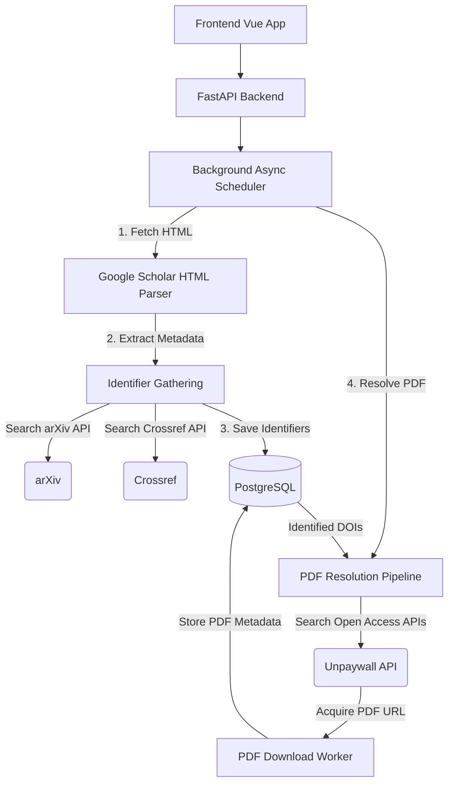

# Architecture

## Data Model Rules

- **Scholar tracking is user-scoped.** Each user manages their own list of tracked scholars. Validate mapping/join tables; never assume global links between users and Scholar IDs.
- **Publications are global, deduplicated records.** Deduplicate via Scholar cluster ID and normalized fingerprinting prior to database insertion.
- **State lives on the link.** Read/unread, favorites, and visibility state exist exclusively on the scholar-publication link table, not the global publication table.

## Domain Service Boundaries

All business logic resides in `app/services/<domain>/`. Flat files in the `app/services/` root are strictly prohibited.

### Ingestion (`app/services/ingestion/`)

Run orchestration, continuation queue, scheduler integration, and scrape safety policy enforcement. The `ScholarIngestionService` drives the primary data acquisition loop.

Key modules:
- `application.py` - Main ingestion orchestrator
- `scheduler.py` - Background tick loop, queue batch processing
- `constants.py` - Safety policy constants and floor values
- `fingerprints.py` - Publication fingerprinting for deduplication
- `types.py` - Ingestion result types and state enums

### Scholar Parsing (`app/services/scholar/`)

Fail-fast Google Scholar HTML parsing and source fetch adapters. Handles paginated HTML feeds, extracts publication blocks via regex and DOM invariants (e.g., `gsc_vcd_cib`).

Key modules:
- `parser.py` - HTML parser for publication extraction
- `parser_utils.py` - Parsing helpers and DOM selectors
- `source.py` - HTTP fetch adapters with browser headers
- `profile_rows.py` - Profile metadata extraction
- `author_rows.py` - Author citation row parsing
- `state_detection.py` - Blocked/CAPTCHA/rate-limit detection

### Scholar Management (`app/services/scholars/`)

Scholar CRUD, profile image management, and name-search controls with rate limiting.

Key modules:
- `application.py` - Scholar lifecycle operations
- `uploads.py` - Image upload handling
- `search_hints.py` - Name search with caching and cooldowns
- `validators.py` - Input validation for scholar creation

### Publications (`app/services/publications/`)

Listing, read-state management, favorite toggles, enrichment scheduling, deduplication, and PDF queue management.

Key modules:
- `application.py` - Publication service facade
- `listing.py` - Filtered listing with pagination (modes: all/unread/latest)
- `queries.py` - Database query builders
- `counts.py` - Aggregation counts for dashboard
- `dedup.py` - Duplicate detection and merging
- `enrichment.py` - Identifier and metadata enrichment orchestration
- `pdf_queue.py` - PDF resolution queue policy
- `pdf_resolution_pipeline.py` - Multi-source PDF resolution (Unpaywall, arXiv)
- `types.py` - Publication DTOs and response types

### Publication Identifiers (`app/services/publication_identifiers/`)

Multi-identifier resolution engine. A single publication can have multiple identifiers (DOI, arXiv ID, PMID, PMCID). This decoupled approach replaced the earlier hardcoded DOI-only model.

Key modules:
- `application.py` - Identifier gathering orchestration
- `normalize.py` - Identifier normalization and validation

### arXiv (`app/services/arxiv/`)

Typed API client with global DB-backed throttle, query cache, and in-flight request coalescing.

Key modules:
- `client.py` - HTTP client for arXiv export API
- `gateway.py` - Gateway with advisory lock, caching, and coalescing
- `cache.py` - Query cache with TTL and max-entry pruning
- `rate_limit.py` - Global rate limiter via `arxiv_runtime_state` table
- `guards.py` - Load-shedding guards (skip when DOI/arXiv evidence exists)
- `parser.py` - Atom XML response parser

Safety features:
- Requests are globally serialized via a PostgreSQL advisory lock and shared runtime row (`arxiv_runtime_state`)
- Identical request payloads are fingerprinted and cached in `arxiv_query_cache_entries` with TTL + max-entry pruning
- Concurrent identical misses are coalesced in-process (one outbound call serves all waiters)

### Crossref (`app/services/crossref/`)

DOI lookup via Crossref REST API with bounded pacing and configurable batch limits.

### Unpaywall (`app/services/unpaywall/`)

Open-access PDF resolution via Unpaywall API, with HTML-based PDF link discovery as a fallback.

Key modules:
- `application.py` - Unpaywall service facade
- `pdf_discovery.py` - HTML page scraping for PDF link candidates

### OpenAlex (`app/services/openalex/`)

Metadata matching via OpenAlex API for supplementary identifier resolution.

Key modules:
- `client.py` - OpenAlex API client
- `matching.py` - Fuzzy title/author matching

### Runs (`app/services/runs/`)

Run history tracking and continuation queue operations.

Key modules:
- `application.py` - Run lifecycle management
- `queue_service.py` - Continuation queue operations (retry, drop, clear)
- `queue_queries.py` - Queue item queries

### Portability (`app/services/portability/`)

Import/export workflows for scholar data with full publication state preservation.

Key modules:
- `application.py` - Import/export orchestration
- `exporting.py` - Scholar export serialization
- `publication_import.py` - Publication import with deduplication
- `scholar_import.py` - Scholar import with link reconstruction
- `normalize.py` - Payload normalization and validation

### Database Operations (`app/services/dbops/`)

Integrity checking, link repair, and near-duplicate repair operations exposed via admin API and CLI scripts.

Key modules:
- `__init__.py` - `collect_integrity_report`, `run_publication_link_repair`
- `near_duplicate_repair.py` - Near-duplicate publication detection and merging

## Data Integration Flow

## API Layer

Routes live in `app/api/routers/`. All responses under `/api/v1` use a strict envelope format. See [API Reference](../reference/api.md) for the full contract.

## Middleware Stack

Applied in `app/main.py`:

1. **CSRF Protection** - Token-based CSRF validation
2. **Session Middleware** - Cookie-based session management (itsdangerous signing)
3. **Request Logging** - Structured request/response logging with configurable skip paths
4. **Security Headers** - Configurable HTTP security headers and CSP
