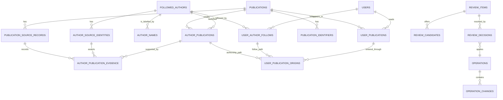

# Scholarr data model

**Status:** DRAFT FOR OWNER REVIEW, 2026-07-23. This spec is review-ready and is not frozen.
No implementation is authorized by this document.

This is Card 1 in [`TASKS.md`](../../TASKS.md). It defines the persistent domain model for
global author and publication identity, per-user follows and reading state, review records,
duplicate prevention, merge and undo, and migration from the legacy Scholarr database.

## Status language

- **DECIDED** records a project decision that this spec must not reopen.
- **PROPOSED** is the concrete default in this draft. It becomes decided only when the owner
  approves and freezes the spec.
- **OPEN Dn** identifies an owner decision listed in [Owner decisions](#owner-decisions).

## Scope and boundaries

This spec owns:

- persistent identities for users, authors, publications, and external identifiers;
- global deduplication and per-user follows, visibility, read state, and retained favorite state;
- provenance paths from a provider record to an author-publication relation and a user's library;
- identity review records and confirmed-different decisions;
- auditable, reversible author and publication merges;
- schema migrations and the one-time legacy data import contract.

This spec does not own provider HTTP behavior, sync scheduling, PDF resolution, login/session
security, configuration syntax, or onboarding screens. Later specs may add tables in those areas,
but they may not weaken the invariants here without reopening Card 1.

## Fixed product invariants

1. **DECIDED:** `FollowedAuthor` is the source-agnostic root author entity.
2. **DECIDED:** names are labels and search aids, never identity keys.
3. **DECIDED:** an author can have multiple `AuthorSourceIdentity` records. Scholar identities
   are inert import metadata and human-clickable links only.
4. **DECIDED:** publications are global and deduplicated across all users.
5. **DECIDED:** follows and reading state are per user.
6. **DECIDED:** exact external identifiers prevent duplicates. Similar names or titles alone do
   not prove identity.
7. **DECIDED:** merges are audited and undoable. A wrong author merge is treated as the most
   damaging identity failure.
8. **DECIDED:** unresolved shells remain explicit. The system never invents certainty when it has
   no name, works, or trusted identifier evidence.
9. **DECIDED:** all persistent storage is SQLite. The write path must fit a serialized-writer
   design from the first migration.
10. **DECIDED:** no row or workflow defined here permits application-initiated Google network
    contact.

## Proposed storage conventions

These conventions apply to every table in this spec unless a table says otherwise.

- Internal joins use `INTEGER PRIMARY KEY` row IDs. API and audit references use a separate,
  immutable UUIDv7 `public_id TEXT NOT NULL UNIQUE`. Internal row IDs never appear in public APIs,
  exports, URLs, or logs intended for users.
- Timestamps are UTC Unix milliseconds in `INTEGER` columns. A timestamp column ending in `_at`
  is nullable only when absence has domain meaning.
- Booleans use `INTEGER NOT NULL CHECK (value IN (0, 1))`.
- Mutable rows carry `row_version INTEGER NOT NULL DEFAULT 1`. Every successful update increments
  it. Undo conflict checks use this version.
- Status and kind values use lower-case text with explicit `CHECK` constraints when the set is
  closed. Provider/source names stay registry-validated text so adding a sanctioned provider does
  not require rebuilding unrelated tables.
- Flexible evidence and audit snapshots use versioned JSON objects stored as UTF-8 text and
  guarded by `json_valid`. Core identifiers, ownership, status, and timestamps never live only in
  JSON.
- Foreign keys are enabled on every connection. Shared author and publication rows use
  `ON DELETE RESTRICT`; user-owned rows use `ON DELETE CASCADE` only after the auth and privacy
  deletion policy permits hard deletion. Actor references use `ON DELETE SET NULL`.
- Every normalization algorithm stores a `normalization_version`. A later algorithm version may
  add new normalized values, but may not silently reinterpret old uniqueness constraints.

**OPEN D1:** approve this internal integer plus public UUIDv7 scheme, or select a different public
identifier strategy before freeze.

## Relationship map

The important separation is:

- `author_publications` answers which canonical author is connected to which global publication;
- `user_publications` holds one coherent reading state for one user and one publication;
- `user_publication_origins` records every followed-author path that put the publication in that
  user's library.

This prevents a publication credited to two followed authors from having contradictory read state
for the same user.

## User root and per-user state

### `users`

Card 5 owns credentials and login identities. Card 1 defines only the domain row referenced by
follows, reading state, review decisions, and operations.

| Column | Contract |
|---|---|
| `id`, `public_id` | Stable internal and public identifiers. |
| `status` | `active`, `disabled`, or `pending_deletion`. |
| `display_name` | User-facing label, not a login key. |
| `created_at`, `updated_at`, `row_version` | Shared storage conventions. |

Login email, username, password hash, OIDC subject, and trusted-header claims belong to the auth
spec and are not columns on this domain row by implication.

### `user_author_follows`

One row represents the complete lifecycle of one user's relationship to one canonical author.

| Column | Contract |
|---|---|
| `id`, `public_id` | Stable follow identity, retained across unfollow and refollow. |
| `user_id`, `author_id` | Required foreign keys. Unique together for all lifecycle states. |
| `status` | `active`, `unfollowed`, or `merged`. |
| `first_followed_at` | Never changes. |
| `active_since` | Changes on a later refollow. |
| `ended_at` | Set when unfollowed or superseded by a merge. |
| `superseded_by_follow_id` | Set only for `merged`; references the surviving follow. |
| `created_at`, `updated_at`, `row_version` | Shared storage conventions. |

An exact refollow reactivates this row. It never creates a second active follow. Unfollowing one
user does not alter the global author, another user's follow, or shared publication metadata.

### `user_publications`

This is the single per-user state row for a global publication.

| Column | Contract |
|---|---|
| `id`, `public_id` | Stable library item identity. |
| `user_id`, `publication_id` | Required and globally unique as a pair. |
| `first_seen_at` | Earliest time any follow path delivered this publication to the user. |
| `first_discovery_kind` | Discovery kind of the earliest origin; does not change when later paths arrive. |
| `read_at` | Null means unread; non-null means read. |
| `favorited_at` | Retains legacy favorite state. No v1 UI is implied by this column. |
| `created_at`, `updated_at`, `row_version` | Shared storage conventions. |

There is no author ID in this table. Marking a publication read through one author marks the same
publication read everywhere for that user, while another user's state remains unchanged.

### `user_publication_origins`

This table preserves why a user can see a publication and makes unfollow, merge, and undo exact.

| Column | Contract |
|---|---|
| `id`, `public_id` | Stable origin identity. |
| `user_publication_id` | Required parent library item. |
| `follow_id` | The user's follow that supplied the path. |
| `author_publication_id` | The canonical authorship path. |
| `discovery_kind` | `baseline`, `incremental_sync`, `manual_import`, or `legacy_import`. |
| `first_seen_at` | When this path first delivered the publication. |
| `created_at` | Immutable creation time. |

The triple `(user_publication_id, follow_id, author_publication_id)` is unique. A library item is
visible while at least one origin resolves through an active follow and active authorship link.
The row and reading state are retained when the final path becomes inactive, so refollow and undo
restore prior state without reconstructing history.

**OPEN D2:** approve the user-library semantics as one decision:

- unfollow hides publications that have no remaining active follow path but preserves their read
  and favorite state;
- a refollow restores that state;
- `favorited_at` is migrated and retained even though the frozen v1 UI has no favorite control;
- a legacy publication is read if any legacy link for that user says read;
- `NEW` is derived only when `first_discovery_kind = 'incremental_sync'` and `first_seen_at` is in a
  configurable age window. A later incremental path cannot make an already-known publication new.
  Baseline, manual, and legacy imports never appear as new.

## Global author identity

### `followed_authors`

| Column | Contract |
|---|---|
| `id`, `public_id` | Stable canonical author identity. |
| `status` | `active` or `merged`. |
| `resolution_state` | `resolved`, `needs_review`, or `shell`. |
| `confidence_band` | `high`, `medium`, `low`, or `shell`; drives the frozen UI label. |
| `display_name` | Preferred label, nullable for a no-data shell. Never an identity key. |
| `sort_name` | Normalized display aid, never unique. |
| `primary_field`, `affiliation` | Nullable selected display metadata. |
| `active_from_year`, `active_to_year` | Nullable selected active-year range. |
| `avatar_ref` | Nullable reference to a locally managed image or generated avatar, never an untrusted remote URL. |
| `merged_into_author_id` | Required only for `merged`; points to an active author. |
| `created_at`, `updated_at`, `row_version` | Shared storage conventions. |

Constraints and application invariants:

- `merged_into_author_id` is null exactly when `status = 'active'`.
- An author cannot merge into itself, and merge chains must be acyclic.
- A later merge retargets every existing alias to the final active winner in the same transaction,
  so stored aliases remain flat rather than forming chains.
- Reads resolve a merged ID to its active target, but APIs preserve the old public ID as a stable
  alias so imported links and audit records do not break.
- A shell is a valid active author. It may contain only an inert Scholar import identity and no
  name or works.

### `author_source_identities`

| Column | Contract |
|---|---|
| `id`, `public_id` | Stable source identity row. |
| `author_id` | Current canonical author, nullable only when the identity is detached after review. |
| `source` | Registered source, initially `openalex`, `orcid`, or `scholar_import`. |
| `external_id_raw` | Original display value. |
| `external_id_normalized` | Canonical value used for equality. |
| `normalization_version` | Parser version used for the normalized value. |
| `profile_url` | Human-clickable source URL. A Scholar URL is never dereferenced by the service. |
| `attachment_method` | `direct`, `provider_crosswalk`, `calibration_auto`, `user_confirmed`, or `legacy_import`. |
| `confidence_score` | Nullable numeric evidence for internal review, never shown as a raw UI percentage. |
| `evidence_version` | Hash or version of the evidence that supported the current attachment. |
| `normalized_metadata_json` | Versioned provider evidence for names, fields, affiliations, active years, and profile image candidates. |
| `first_observed_at`, `last_observed_at` | Provenance timestamps. |
| `status` | `active` or `detached`. |
| `created_at`, `updated_at`, `row_version` | Shared storage conventions. |

`(source, external_id_normalized)` is globally unique, including detached rows. Reattaching an
existing identity updates its author and audit history; it never creates a duplicate identity.

Exact source identity equality always resolves to the existing canonical author. A name match,
even an exact one, never does. One author may hold more than one OpenAlex identity when the owner
confirms that split profiles represent the same person.

The selected fields on `followed_authors` are projections from these source records. Projection
precedence is defined with provider contracts. Source evidence remains available when a selected
display value changes.

### `author_names`

Provider labels, aliases, and transliterations are preserved without gaining identity power.

| Column | Contract |
|---|---|
| `id`, `public_id` | Stable label identity. |
| `author_id` | Required canonical author. |
| `name`, `normalized_name` | Display/search forms. Neither is unique. |
| `kind` | `preferred`, `alias`, or `transliteration`. |
| `locale` | Optional BCP 47 language tag. |
| `source_identity_id` | Optional provenance pointer. |
| `status` | `active` or `retired`. |
| `created_at` | Immutable creation time. |

At most one active preferred name exists per author. Changing the preferred name does not change
identity or create a merge candidate by itself.

**OPEN D3:** approve the automatic cross-source attachment boundary:

- exact reuse of an already stored source identity is automatic;
- an explicit provider crosswalk, such as an ORCID asserted on the selected OpenAlex record, may
  attach both identities in the same operation;
- completed calibration rows classified `auto` may attach the OpenAlex identity to the imported
  Scholar shell;
- calibration `review`, name-only similarity, works-overlap below the frozen auto threshold, and
  conflicting strong identifiers always create or update a review item;
- `unmatched` remains a shell.

The numerical auto threshold belongs to the onboarding or matching spec. Card 1 freezes only the
trust boundary above.

## Global publication identity and provenance

### `publications`

| Column | Contract |
|---|---|
| `id`, `public_id` | Stable global publication identity. |
| `status` | `active` or `merged`. |
| `canonical_title`, `normalized_title` | Selected display title and normalized comparison text. |
| `canonical_title_hash` | Versioned blocking key for candidate lookup, not a uniqueness key. |
| `publication_date`, `publication_year` | Nullable normalized date fields. |
| `venue`, `publication_type` | Nullable selected display metadata. |
| `merged_into_publication_id` | Required only for `merged`. |
| `created_at`, `updated_at`, `row_version` | Shared storage conventions. |

The selected display fields are projections from source records. Later provider specs define
source precedence and freshness. A projection update never discards the underlying source record.

### `publication_source_records`

One row represents one provider's record of a work.

| Column | Contract |
|---|---|
| `id`, `public_id` | Stable provenance row. |
| `publication_id` | Current canonical publication. |
| `source`, `external_id_normalized` | Globally unique as a pair. |
| `record_version` | Provider version, update timestamp, or content hash when supplied. |
| `normalized_metadata_json` | Versioned normalized title, authors, date, venue, and type evidence. |
| `raw_payload_hash` | Optional integrity pointer. Raw provider payload retention is defined later. |
| `first_observed_at`, `last_observed_at` | Provenance timestamps. |
| `created_at`, `updated_at`, `row_version` | Shared storage conventions. |

`legacy_import` is a local provenance source, not a network provider. Its external ID includes a
non-secret dump fingerprint and legacy row ID so repeated dry runs remain idempotent.

### `publication_identifiers`

| Column | Contract |
|---|---|
| `id`, `public_id` | Stable identifier row. |
| `publication_id` | Current canonical publication. |
| `kind` | Registered identifier namespace, initially `doi`, `arxiv`, `openalex`, `pmid`, or `pmcid`. |
| `value_raw`, `value_normalized` | Display and equality forms. |
| `normalization_version` | Parser version. |
| `first_source_record_id` | Provenance for the first accepted assertion. |
| `confidence_score` | Bounded 0 through 1; internal evidence only. |
| `created_at`, `updated_at`, `row_version` | Shared storage conventions. |

`(kind, value_normalized)` is globally unique, not merely unique within a publication. Repeated
evidence attaches to the existing identifier. If an accepted strong identifier already belongs to
another publication, ingestion must resolve the collision through the publication merge policy in
the same transaction or stop for review. It may not insert a duplicate.

### `author_publications` and `author_publication_evidence`

`author_publications` is the canonical many-to-many relationship. Its pair
`(author_id, publication_id)` is unique for all lifecycle states. It carries `status` (`active` or
`retired`), stable internal and public IDs, `first_observed_at`, `last_observed_at`, and the shared
audit fields.

`author_publication_evidence` records why the relationship exists. It references one
`author_publication`, an optional `author_source_identity`, and one `publication_source_record`.
It has stable internal and public IDs. The tuple of those three references is unique. Removing or
correcting one provider assertion does not erase other evidence for the same authorship link.

## Duplicate prevention and merge rules

### Authors

1. An incoming `(source, external_id_normalized)` already in the database resolves to that
   identity's active author.
2. A different user following that identity creates only a new `user_author_follows` row.
3. Same-name records with different identifiers remain separate. The UI may raise a soft review
   notice, but name equality never blocks creation or causes a merge.
4. Cross-source matches follow the D3 trust boundary. Ambiguous evidence creates one review item,
   not a speculative identity attachment.
5. A merge target is selected deterministically: resolved beats shell, more accepted strong
   identities beats fewer, older `created_at` wins the next tie, and lowest `public_id` wins the
   final tie. Caller argument order cannot change the result.

### Publications

1. Exact provider record identity or exact normalized DOI, arXiv, PMID, or PMCID resolves to the
   existing publication.
2. A provider's explicit work crosswalk may add another identifier to that publication.
3. `canonical_title_hash` narrows candidate lookup only. Title, year, author string, venue, or a
   fuzzy score cannot be a global uniqueness constraint.
4. Conflicting strong identifiers block automatic merge. The system records an admin-visible data
   quality finding and leaves both publications intact.
5. A publication merge uses the same deterministic target rule: more strong identifiers, then
   more source records, then older creation, then lowest public ID.
6. A merge reassigns source records, identifiers, authorship links, library rows, and origins in
   one transaction. Duplicate links are coalesced without losing the per-user read/favorite state
   or provenance. The losing publication remains as `merged` with a stable alias.
7. A later merge retargets all earlier aliases to the final active winner in the same transaction.

The legacy Scholar cluster ID may be retained as `legacy_import` evidence, but it is not a new
root identifier and never outranks a sanctioned provider identifier.

## Identity review model

The v1 user-facing identity queue has exactly the four decided card types:

- `identify_shell`;
- `confirm_ambiguous_match`;
- `possible_duplicate`;
- `not_this_person_fallout`.

### `review_items`

| Column | Contract |
|---|---|
| `id`, `public_id` | Stable card identity. |
| `type` | One of the four types above. |
| `subject_author_id` | Required primary author. |
| `related_author_id` | Optional second author, stored in canonical public-ID order for pair cards. |
| `dedupe_key` | Deterministic key based on card type and subject or pair. |
| `evidence_version` | Changes only when materially new evidence arrives. |
| `status` | `open`, `skipped`, `resolved`, or `superseded`. |
| `raised_count` | Diagnostic count; repeated syncs do not create repeated cards. |
| `first_raised_at`, `last_raised_at`, `resolved_at` | Lifecycle timestamps. |
| `created_at`, `updated_at`, `row_version` | Shared storage conventions. |

There is at most one non-superseded row per `dedupe_key`. A repeated failure updates
`last_raised_at` and `raised_count`. A skipped or resolved card may reopen only when its
`evidence_version` changes.

### `review_candidates` and `review_decisions`

`review_candidates` has stable internal and public IDs and stores the stable candidate order. A
candidate may reference an existing author or identity, or carry a proposed source plus normalized
external ID that does not become an `author_source_identities` row until acceptance. A versioned
evidence summary supplies the UI. No candidate creates an identity attachment before the user
decides.

`review_decisions` has stable internal and public IDs and is append-only. It records the item,
action, actor, selected candidate or target, evidence version, operation ID, creation time, and
optional `undone_at`. A later decision never overwrites an earlier one.

### Negative identity evidence

Two small tombstone tables prevent review loops:

- `confirmed_different_author_pairs` stores the canonical ordered author pair, confirmed evidence
  version, deciding user, decision ID, and time.
- `rejected_author_identity_links` stores an author plus source identity candidate, confirmed
  evidence version, deciding user, decision ID, and time.

The detector suppresses evidence at or below the confirmed version. Materially new evidence may
reopen the same review item rather than creating a second card.

## Audit and undo

### `operations`

Every consequential write groups into one operation. Kinds include `author_merge`,
`publication_merge`, `review_decision`, `bulk_import`, `unfollow`, `refollow`, and
`admin_repair`.

The row stores `id`, `public_id`, kind, actor user if retained, source context, status (`applied` or
`undone`), a safe summary JSON object, `created_at`, `undone_at`, and a link to the reversing
operation when applicable.

### `operation_changes`

Each row stores an operation-local sequence number, entity type, entity public ID, change kind,
versioned before and after JSON, and the entity's `row_version` after the write. The pair
`(operation_id, sequence)` is unique. Snapshots contain only fields required to explain and
reverse the domain change. Credentials, tokens, raw provider payloads, and password data are
forbidden.

### Transaction and undo contract

- The domain write, audit rows, and review decision commit in one SQLite transaction.
- An undo applies changes in reverse order in a new operation. It is all-or-nothing.
- Before undo, every touched row must still match the recorded after-version or an explicitly
  defined non-conflicting successor state. A conflict stops the undo without partial changes and
  reports the exact blocking entities.
- Undo restores moved source identities, follows, authorship links, library origins, review state,
  and negative-evidence tombstones. Rows coalesced during a merge are restored from their recorded
  lifecycle states rather than recreated with new IDs.
- Merged author and publication rows are retained. Undo never depends on recovering a deleted
  canonical row.
- Immediate UI undo and later Activity undo call the same domain operation.

**OPEN D4:** approve state-based undo with no arbitrary time limit while the conflict preconditions
still hold. The alternative is a fixed undo window followed by admin-only repair.

## Deletion and retention

- Unfollow is a reversible lifecycle change, not deletion.
- Removing one user cannot delete a shared author, publication, source record, identifier, or
  another user's library state.
- Merged rows, operation records, and negative identity evidence are not garbage collected while
  they can support alias resolution or undo.
- Provider cache retention is outside this spec. Provenance rows needed to explain canonical data
  remain.
- A future privacy deletion flow may remove or anonymize user-owned rows after its recovery window,
  but it must leave shared scientific metadata intact and null actor references where required.

**OPEN D5:** approve no automatic orphan deletion. The proposed policy retains unfollowed authors
and publications until an explicit admin garbage-collection operation runs with a backup, dry-run
preview, reference checks, and an audit record.

## Migration contract

### Rewrite schema migrations

1. Every release carries numbered, deterministic migrations with explicit up and down behavior.
2. Startup takes an application migration lock before serving traffic.
3. A pre-migration SQLite backup is mandatory for a version change. Backup verification and
   restore UX are release-gate concerns, but the migration may not proceed after backup failure.
4. Table rebuilds use create-copy-verify-swap inside the safest transaction SQLite permits.
5. Each migration runs `foreign_key_check` plus model-specific invariant queries before commit.
6. CI tests every migration up and down from a seeded prior-version database.
7. A failed migration leaves the prior database usable or restores the verified backup. It never
   continues with a partly upgraded schema.

### One-time legacy import

The Postgres dump is an identity seed and partial publication floor, not ground truth. Import is an
offline, restart-safe process with a mandatory dry-run report. It never contacts any provider.

The import proceeds in this order:

1. Validate the dump fingerprint and schema revision. Record an `import_run` with a non-secret
   source fingerprint, importer version, status, counts, and errors.
2. Map legacy users to already-created rewrite users through an explicit local mapping. Credential
   and login migration waits for the auth spec. Real emails never appear in logs or fixtures.
3. Collapse duplicate legacy Scholar IDs into one `scholar_import` source identity and one global
   author. Create separate per-user follow rows. Apply the D3 calibration policy to OpenAlex
   mappings; unresolved rows remain shells.
4. Import global publications and normalized identifiers. Preserve every legacy row as a
   `legacy_import` source record. Strong identifier collisions use the normal merge rules; title
   hash collisions are reported, not silently merged.
5. Import canonical author-publication links and provenance, then construct each user's
   publication origins through that user's follows.
6. Collapse legacy per-profile reading state into one `user_publications` row per user and
   publication using D2. Mark every imported origin `legacy_import`, so the historical corpus does
   not appear as newly discovered.
7. Run invariant checks and emit a dry-run or applied report. Counts include source rows, distinct
   authors, follows, shells, review items, publications, identifier collisions, read-state
   collapses, and favorites preserved. Reports contain no names, emails, titles, or source IDs.

`legacy_import_mappings` records `(source_fingerprint, legacy_table, legacy_row_id)` to new public
ID and import run. The triple is unique, making reruns idempotent. Applied reruns verify and reuse
the mapping rather than duplicating domain rows.

The private real dump and calibration payloads remain outside git. Public tests use synthetic,
anonymized fixtures that reproduce the same relationship shapes.

## Integrity checks and observability

The application exposes or logs safe counts for these checks:

- no duplicate active source identity or publication identifier;
- no user-author or user-publication duplicate;
- no merged cycle and no merge target that is itself unresolved at query completion;
- every visible user publication has at least one active origin;
- every origin's follow and authorship link agree on the same canonical author;
- every active authorship link has at least one evidence row, except an explicit manual import;
- every resolved review decision references an applied or undone operation;
- every applied merge has a complete operation change set;
- no open review duplicate by `dedupe_key`;
- no foreign-key violations or malformed versioned JSON.

Logs and reports use public IDs, counts, operation kinds, and error codes. They do not emit raw
provider payloads, full imported URLs, publication titles, author names, credentials, or personal
email addresses by default.

## Deterministic acceptance tests

Card 1 is ready to implement only after freeze, and implementation is accepted only when these
tests exist:

1. Two users follow the same OpenAlex ID: one author, one source identity, two follow rows.
2. Two different OpenAlex IDs share an identical name: two authors, no automatic merge.
3. One user follows two authors who share a publication: one user-publication state, two origins,
   one read toggle everywhere for that user.
4. Another user sees the same global publication but retains independent read state.
5. Unfollow removes the last visible origin, preserves state, and refollow restores it.
6. Author merge and undo restore identities, follows, origins, review state, and aliases exactly.
7. A post-merge conflicting edit blocks undo without partial reversal.
8. Exact DOI and arXiv identifiers deduplicate; title hash similarity alone does not.
9. Publication merge preserves all source records, identifiers, authorship evidence, origins, and
   per-user state; undo restores the prior graph.
10. Repeated unresolved sync events update one review card. A new evidence version reopens it.
11. Confirmed-different and rejected-identity tombstones suppress unchanged evidence.
12. Legacy import is idempotent, any-read collapse follows D2, favorites follow D2, and no legacy
    origin is marked new.
13. Each schema migration passes up, down, foreign-key, integrity, and interrupted-upgrade tests.
14. Property tests prove normalization idempotence, merge outcome independence from argument order,
    and stable public-ID alias resolution.
15. Merging an earlier winner into a third entity flattens every author or publication alias to the
    final active winner; undo restores the prior flat mapping.

## Owner decisions

The draft recommends one answer for each unresolved choice:

| ID | Decision | Recommended answer |
|---|---|---|
| D1 | Public identity shape | Internal integer keys plus immutable UUIDv7 public IDs. |
| D2 | User-library semantics | Hide on last unfollow but retain state; any-read wins legacy collapse; preserve favorites; derive `NEW` only from recent incremental sync. |
| D3 | Cross-source auto-attachment | Auto only exact IDs, explicit provider crosswalks, and completed calibration `auto` rows; review everything weaker or conflicting. |
| D4 | Undo horizon | No time limit while recorded row-version preconditions still hold; otherwise stop with a conflict. |
| D5 | Orphan retention | Never delete automatically; require explicit backed-up, dry-run, audited admin garbage collection. |

Freezing this spec means the owner has answered D1 through D5, approved any resulting edits, and
explicitly changed the status at the top to `FROZEN` with the approval date. Until then, no schema
or implementation work begins.
